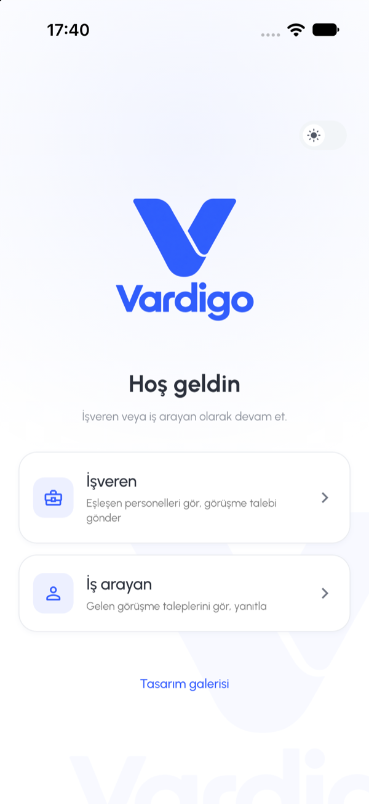
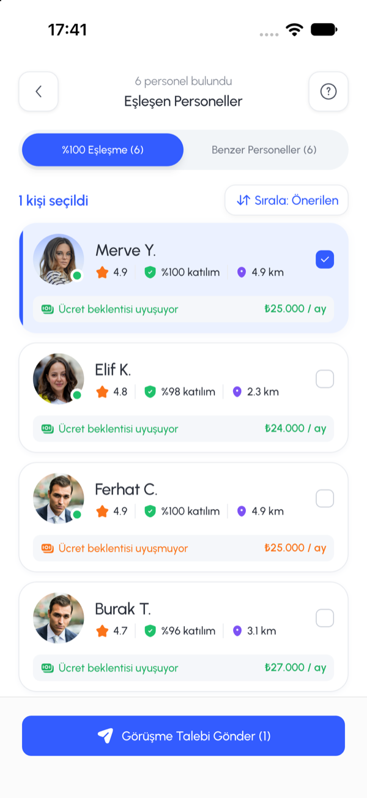
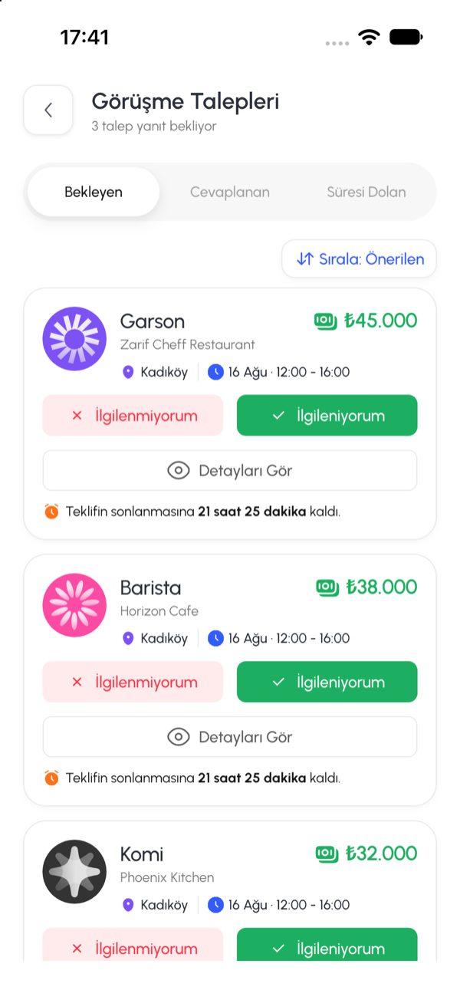
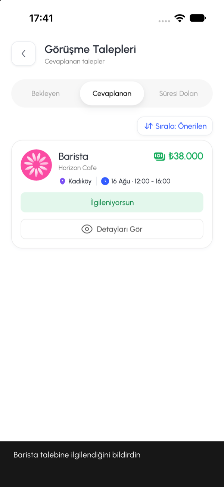

# Vardigo

İki ekranlı işe alım case'i: **Flutter mobil uygulama** (iOS ve Android) ve ona veri veren **REST API** (Node.js + SQLite).

- **İşveren** "Eşleşen Personeller" ekranında adayları görür, seçer ve görüşme talebi gönderir.
- **İş arayan** "Görüşme Talepleri" ekranında gelen talepleri görür, kabul eder veya reddeder. Kararlar kalıcıdır.
- **İşveren** aday kartında talebin ne olduğunu görür: yanıt bekleniyor, kabul etti, reddetti veya süresi doldu.

| Parça | Durum |
|---|---|
| Backend | Tamamlandı: case'teki tüm endpoint'ler, SQLite kalıcılığı, Swagger (yanıtlar şemaya karşı testli), 197 test |
| Mobil | Tamamlandı: iki case ekranı, rol seçimi, açık/koyu tema, uygulama ikonu ve açılış logosu, 390×844 telefon çerçevesi, golden testler, 122 test |

| Rol seçimi | İşveren: Eşleşen Personeller | İş arayan: Bekleyen talepler | İş arayan: Yanıt sonrası |
|:---:|:---:|:---:|:---:|
|  |  |  |  |

iOS simülatöründe, gerçek API'ye bağlı olarak alındı.

**İçindekiler:** [Değerlendirenler için: indir ve çalıştır](#değerlendirenler-için-indir-ve-çalıştır) · [Case akışını deneme](#case-akışını-deneme) · [Yalnız API'yi inceleme](#yalnız-apiyi-inceleme) · [Testler](#testler) · [Sorun giderme](#sorun-giderme) · [API özeti](#api-özeti) · [Case yorumları](#case-yorumları) · [Teknoloji ve klasörler](#teknoloji-ve-klasörler) · [Geliştirme süreci](#geliştirme-süreci)

---

## Değerlendirenler için: indir ve çalıştır

Docker, ayrı bir veritabanı kurulumu, `.env` dosyası veya hesap gerekmez. SQLite Node'un içinde gelir; demo veri ilk açılışta otomatik yüklenir.

### 1. Gereksinimler

| Araç | Sürüm | Kontrol |
|---|---|---|
| Git | herhangi | `git --version` |
| Node.js | **24 LTS** (26 ve üstü de olur) | `node -v` |
| Flutter | **3.47.x stable** (Dart 3.13) | `flutter --version` |
| iOS için | macOS, Xcode ve bir iOS simülatörü (iOS 15+) | `xcrun simctl list devices` |
| Android için | Android Studio ve bir emülatör | `flutter emulators` |

- **Node 25 kullanmayın.** Test aracı `vitest` Node 25'i desteklemiyor ve `npm ci` bu sürümde durur. Node 24 LTS'yi [nodejs.org](https://nodejs.org) adresinden ya da `nvm install 24 && nvm use 24` ile kurabilirsiniz.
- `flutter doctor` eksik araçları listeler. iOS bağımlılıkları Swift Package Manager ile gelir; CocoaPods gerekmez.
- Kod üretiminin çıktıları (route'lar, asset/renk/font sınıfları, metinler) repoda hazır. `build_runner` veya `gen-l10n` çalıştırmanız gerekmez.

### 2. Repoyu indirin

```bash
git clone https://github.com/cengizhankkaya/vardigo.git
cd vardigo
```

GitHub'dan ZIP olarak indirdiyseniz klasöre girip aşağıdaki komutları `./demo.sh` yerine `bash demo.sh` ile çalıştırın (ZIP dosya izinlerini korumayabilir).

### 3. Tek komutla çalıştırın (macOS / Linux)

Önce bir simülatör veya emülatör açın:

```bash
open -a Simulator                   # iOS simülatörü (macOS)
# ya da
flutter emulators                   # Android emülatörlerini listeler
flutter emulators --launch <id>     # birini açar
```

Sonra repo kökünde:

```bash
./demo.sh
```

Betik sırasıyla şunları yapar:

1. Node sürümünü kontrol eder.
2. İlk çalıştırmada API bağımlılıklarını kurar (`npm ci`).
3. API'yi `http://localhost:3000` adresinde başlatır ve hazır olmasını bekler.
4. Uygulamayı açık simülatörde/emülatörde gerçek API'ye bağlı olarak çalıştırır.

İlk çalıştırma, bağımlılık kurulumu ve ilk derleme yüzünden birkaç dakika sürebilir; sonrakiler hızlıdır. Uygulamayı kapatınca (terminalde `q`) API de durur.

| Seçenek | Ne yapar |
|---|---|
| (yok) | Rol seçim ekranıyla açılır |
| `--as employer` | Doğrudan Eşleşen Personeller (işveren) |
| `--as worker` | Doğrudan Görüşme Talepleri (iş arayan) |
| `--frame` | Uygulamayı referanstaki 390×844 telefon çerçevesinin (bezel, Dynamic Island, 9:41) içinde gösterir; referans PNG'lerle yan yana karşılaştırmak için |
| diğerleri | `flutter run`'a geçer, ör. `-d emulator-5554` veya `-d <iPhone adı>` |

Örnek: `./demo.sh --as employer --frame`

### 4. Elle çalıştırma (Windows veya adım adım)

`demo.sh` bash betiğidir. Windows'ta veya adımları ayrı görmek isterseniz iki terminal kullanın:

```bash
# 1. terminal: API
cd apps/api
npm ci
npm run dev
```

```bash
# 2. terminal: uygulama (simülatör/emülatör açıkken)
cd apps/mobile
flutter pub get
flutter run
```

Uygulama API'yi platforma göre otomatik bulur: iOS simülatöründe `127.0.0.1:3000`, Android emülatöründe `10.0.2.2:3000`. Gerçek bir telefonda denemek için telefon ve bilgisayar aynı Wi-Fi'da olmalı:

```bash
cd apps/api && HOST=0.0.0.0 npm run dev
cd apps/mobile && flutter run --dart-define=API_ORIGIN=http://<bilgisayarın-IP-adresi>:3000
```

Gerçek iPhone'a yüklemek için Xcode'da bir geliştirici hesabıyla imzalama gerekir; simülatörde gerekmez.

---

## Case akışını deneme

Temiz veriyle başlamak için API kapalıyken bir kez `cd apps/api && npm run db:reset` çalıştırın. `./demo.sh` ile açıp şunları yapın:

1. **İşveren** kartına dokunun. "Eşleşen Personeller" açılır: "%100 Eşleşme (6)" ve "Benzer Personeller (6)" sekmeleri, ilk aday Merve seçili.
2. "Benzer Personeller" sekmesine geçip Derya'yı da seçin. Üstte "2 kişi seçildi", altta "Görüşme Talebi Gönder (2)" yazar. Seçim sekmeler arasında korunur.
3. "Sırala" düğmesi Önerilen → En Yakın → Puan arasında geçiş yapar.
4. "Görüşme Talebi Gönder (2)" düğmesine basın. Talepler oluşturulur, gönderilenler seçimden çıkar ve kartlarında "Görüşme talebi gönderildi · yanıt bekleniyor" etiketi belirir. Yanıt bekleyen aday tekrar seçilemez (API de ikinci talebi 409 ile reddeder).
5. Sol üstteki geri düğmesiyle rol seçimine dönün (oturum kapanır) ve **İş arayan** kartına dokunun. "Bekleyen" sekmesinde seed'deki 3 talebin yanında yeni gönderilen 2 talep de görünür; her kartta kalan süre sayacı vardır.
6. Bir talepte **İlgileniyorum**, diğerinde **İlgilenmiyorum** seçin. İkisi de "Cevaplanan" sekmesine geçer.
7. Geri dönüp **İşveren** olarak tekrar girin. Merve ve Derya'nın kartlarında artık "Görüşme talebini kabul etti" / "Görüşme talebini reddetti" yazar. Yanıtlanan adaya yeni talep gönderilebilir.
8. Uygulamayı kapatıp yeniden açın: kararlar aynı kalır, çünkü veri SQLite dosyasında tutulur (`apps/api/data/vardigo.db`).

İki taraf aynı API ve veritabanını kullanır; bağlantı `offers` tablosudur. Anlık bildirim yoktur: ekranlar açılışta, aşağı çekip yenileyince ve uygulama öne gelince API'den güncel durumu alır. Case'te tek iş arayan hesabı olduğu için hangi adaya gönderilirse gönderilsin talep o hesabın gelen kutusuna düşer.

Ek olarak: rol ekranının sağ üstündeki anahtar açık/koyu temayı değiştirir, seçim cihazda saklanır. Debug derlemede rol ekranından "Tasarım galerisi" (font, renk, ikon ve bileşen örnekleri) açılır.

---

## Yalnız API'yi inceleme

```bash
cd apps/api
npm ci
npm run dev
```

- API: http://localhost:3000/api
- **Swagger:** http://localhost:3000/api/docs. "Authorize" düğmesine `dev-employer` (işveren) veya `dev-worker` (iş arayan) yazıp istekleri tarayıcıdan deneyebilirsiniz.

`curl` ile:

```bash
curl http://localhost:3000/api/candidates -H "Authorization: Bearer dev-employer"
curl -X POST http://localhost:3000/api/offers -H "Authorization: Bearer dev-employer" \
  -H "Content-Type: application/json" -d '{"workerIds":["w_merve","w_derya"]}'
curl "http://localhost:3000/api/offers?status=pending" -H "Authorization: Bearer dev-worker"
```

Case'in minimum akışını çalışan sunucuya karşı otomatik doğrulamak için ikinci bir terminalde:

```bash
cd apps/api
npm run smoke
```

```text
✓ 1. İşveren adayları görür: 12 kişi (%100 eşleşme 6, benzer 6)
✓ 2. Merve + Derya'ya talep: 201 created 2
✓ 3. İş arayan talepleri görür: 5 bekleyen (yeni 2 + önceden bekleyenler)
✓ 4. Biri kabul, biri ret: accept 200, reject 200
✓ 5. Cevaplananlar: accepted, rejected
✓ 6. Yenileyince aynı durum: accepted, rejected
```

Smoke testi veri yazar; tekrar çalıştırmadan önce sunucuyu durdurup `npm run db:reset` yapın. Tüm alanlar, örnek yanıtlar ve hata kodları: [apps/api/README.md](apps/api/README.md).

---

## Testler

```bash
cd apps/api
npm test            # 197 test; her test kendi geçici veritabanını kullanır
npm run typecheck

cd apps/mobile
flutter analyze
flutter test        # 122 test (6 golden dahil)
```

- **Golden testler** iki case ekranını açık ve koyu temada 390×844'te çizip kayıtlı PNG'lerle karşılaştırır. PNG'ler macOS'ta üretildiği için Linux ve Windows'ta yazı çizimi farkıyla başarısız olabilir; orada `flutter test --exclude-tags golden` kullanın.
- **Canlı API testi** case akışını uygulamanın kendi repository'leri üzerinden gerçek sunucuya karşı çalıştırır:

  ```bash
  cd apps/api && npm run db:reset && npm run dev                                    # 1. terminal
  cd apps/mobile && LIVE_API_ORIGIN=http://127.0.0.1:3000 flutter test test/live   # 2. terminal
  ```

- Case'in altı adımlık minimum testi, sunucunun yeniden başlatılması dahil, [apps/api/test/minimum-flow.test.ts](apps/api/test/minimum-flow.test.ts) içinde de otomatik çalışır.

**CI** (GitHub Actions) her push'ta dört işi çalıştırır: backend (tip kontrolü, test, derleme, smoke), mobil (kod üretiminin güncelliği, format, analiz, test), macOS'ta golden testler ve uygulamanın repository'lerini gerçek sunucuya karşı çalıştıran canlı test.

---

## Sorun giderme

| Belirti | Çözüm |
|---|---|
| `npm ci` "EBADENGINE / Unsupported engine" hatası veriyor | Node 25 kullanılıyor. Node 24 LTS kurun: `nvm install 24 && nvm use 24`. |
| `./demo.sh: Permission denied` | `bash demo.sh` ile çalıştırın. |
| Uygulama eski veya beklenmedik veri gösteriyor | `demo.sh`, 3000 portunda çalışan bir API bulursa onu kullanır. O sunucuyu kapatın, `cd apps/api && npm run db:reset` çalıştırıp tekrar açın. |
| 3000 portu başka bir uygulamada | O uygulamayı kapatın. Ya da API'yi `PORT=3100 npm run dev` ile açıp uygulamayı `flutter run --dart-define=API_ORIGIN=http://127.0.0.1:3100` ile çalıştırın. |
| "Görüşme Talebi Gönder" 409 hatası veriyor | O adaylara bekleyen talep zaten var (case kuralı). Başka aday seçin ya da veriyi `db:reset` ile sıfırlayın. |
| Android emülatöründe bağlantı hatası | API'nin açık olduğunu kontrol edin. Emülatör bilgisayara `10.0.2.2` üzerinden bağlanır; bu adres otomatik seçilir. |
| Gerçek telefonda bağlantı hatası | API'yi `HOST=0.0.0.0` ile açın, uygulamaya `--dart-define=API_ORIGIN=http://<IP>:3000` verin. Telefon ve bilgisayar aynı ağda olmalı. |
| `flutter run` cihaz bulamıyor | Önce simülatörü/emülatörü açın; `flutter devices` listede göstermeli. |
| Golden testler Linux/Windows'ta başarısız | Beklenen durum; PNG'ler macOS'ta üretilir. `flutter test --exclude-tags golden`. |

---

## API özeti

Tüm yanıtlar `{ ok: true, data }` veya `{ ok: false, error: { code, message } }` biçimindedir. Hata mesajları Türkçedir.

| Metot | Yol | Rol | Açıklama |
|---|---|---|---|
| POST | `/api/auth/login` | — | `{ "role": "employer" \| "worker" }` → demo token |
| GET | `/api/candidates` | İşveren | Eşleşen adaylar, iki sekmenin sayıları ve her adaya giden son talebin durumu (`offerStatus`); `tab=perfect\|similar`, `sort=recommended\|near\|rating` |
| POST | `/api/offers` | İşveren | `{ "workerIds": [...] }` → seçilen adaylara görüşme talebi (hepsi ya da hiçbiri) |
| GET | `/api/offers` | İş arayan | Talepler; `status=pending\|answered\|expired`, `sort=recommended\|expiring\|pay` |
| GET | `/api/offers/:id` | İş arayan | Talep detayı |
| POST | `/api/offers/:id/accept` | İş arayan | İlgileniyorum |
| POST | `/api/offers/:id/reject` | İş arayan | İlgilenmiyorum |

Hatalı istekler `4xx` ve açıklayıcı mesaj döner: boş seçim ve geçersiz parametre 400, token yok veya yanlış rol 401, bilinmeyen aday veya talep 404, zaten bekleyen talep, yanıtlanmış veya süresi dolmuş talep 409.

---

## Case yorumları

Case paketindeki bazı bilgiler birbiriyle çelişiyor veya tanımsız; uygulanan kararlar:

- **Sekmeler:** API spesifikasyonundaki score ≥ 80 kuralı esas alındı. "%100 Eşleşme" sekmesinde Merve ve Ferhat dahil 6, "Benzer" sekmesinde Derya ve Ayşe dahil 6 kişi görünür. Ekran spesifikasyonundaki "ikinci sekmede aynı kartlar ters sırada" ifadesi uygulanmadı.
- **Aday sayıları:** Referanstaki 26 / 16 sabit etiket olarak alınmadı; `totalPerfect` ve `totalSimilar` aday tablosundan hesaplanır (seçili sekmeden bağımsız). Case seed'indeki 4 adaya 8 demo aday eklendi (toplam 12, 6 / 6). Case'te yalnız 4 fotoğraf olduğu için yeni adaylar bu fotoğrafları tekrar kullanır. Bekleyen talep başlığındaki 12 ise referanstaki sabit etikettir (`pendingCountLabel`); gerçek sayı `pendingCount` alanında döner.
- **Aday ücret satırı:** Seed'de ücret bilgisi yok; case'in 4 adayının "Ücret beklentisi uyuşuyor/uyuşmuyor · ₺25.000 / ay" değerleri referans tasarımdan alındı (Merve ve Ayşe uyuşuyor, Derya ve Ferhat uyuşmuyor). Eklenen adayların ücretleri demo değeridir.
- **Talep sıralaması:** Referansta "Sırala: Önerilen" düğmesi var ama seçenekler tanımlı değil. Önerilen (en yeni önce), süresi en yakın biten ve ücret seçenekleri eklendi.
- **Tek iş arayan:** Case'te bir iş arayan hesabı olduğu için hangi adaya gönderilirse gönderilsin talepler o hesabın gelen kutusuna düşer.
- **Süre:** Seed'deki `USE_NOW_PLUS_21H32M` gibi süreler ilk kurulum anından hesaplanır. Yanıtlanmış talepler süre geçince `expired` olmaz.
- **Giriş:** `dev-employer` / `dev-worker` token'ları case gereği sabit ve herkese açıktır; gerçek bir kimlik doğrulama değildir. Sunucu varsayılan olarak yalnız bu bilgisayardan erişilebilir (`127.0.0.1`).
- **Görsel farklar:** Referans PNG'lerle bilinen farklar (fotoğraf eşlemesi, ₺ işaretinin fontu, başlık sayıları) [apps/mobile/README.md](apps/mobile/README.md#referansla-farklar) içinde listelenir.

---

## Teknoloji ve klasörler

- **Backend:** Node.js 24, TypeScript, Express 5, `node:sqlite`; testler Vitest + Supertest; Swagger UI. Ayrıntı: [apps/api/README.md](apps/api/README.md).
- **Mobil:** Flutter 3.47 / Dart, iOS ve Android; Riverpod, go_router (tip güvenli route'lar, deep link), Dio, flutter_svg, shared_preferences; açık ve koyu tema; FlutterGen (asset, renk, font) ve gen-l10n (metinler). Ayrıntı: [apps/mobile/README.md](apps/mobile/README.md).
- **Mimari:** İki tarafta da katmanlı yapı (domain / application / infrastructure / presentation, use case'ler ve repository port'ları). Katman kuralları iki tarafta da testle denetlenir.

```text
vardigo/
├── apps/
│   ├── api/            # Backend: kaynak, testler, seed verisi, fotoğraf ve logolar
│   └── mobile/         # Flutter iOS/Android uygulaması
├── .github/workflows/  # CI
├── screenshots/        # README'deki ekran görüntüleri
├── demo.sh             # Tek komutla API + uygulama
└── SUREC.txt           # Süreç notu: araçlar, sıra, takılınan noktalar
```

---

## Geliştirme süreci

Her özellik ayrı bir branch'te küçük commit'lerle geliştirildi ve CI yeşilken merge commit ile `main`'e birleştirildi; her adım Git geçmişinde ayrı görünür (`git log --graph --oneline`). Testler ilgili özellikle aynı commit'lerde yazıldı. Kullanılan araçlar, sıra ve takılınan noktalar: [SUREC.txt](SUREC.txt).
